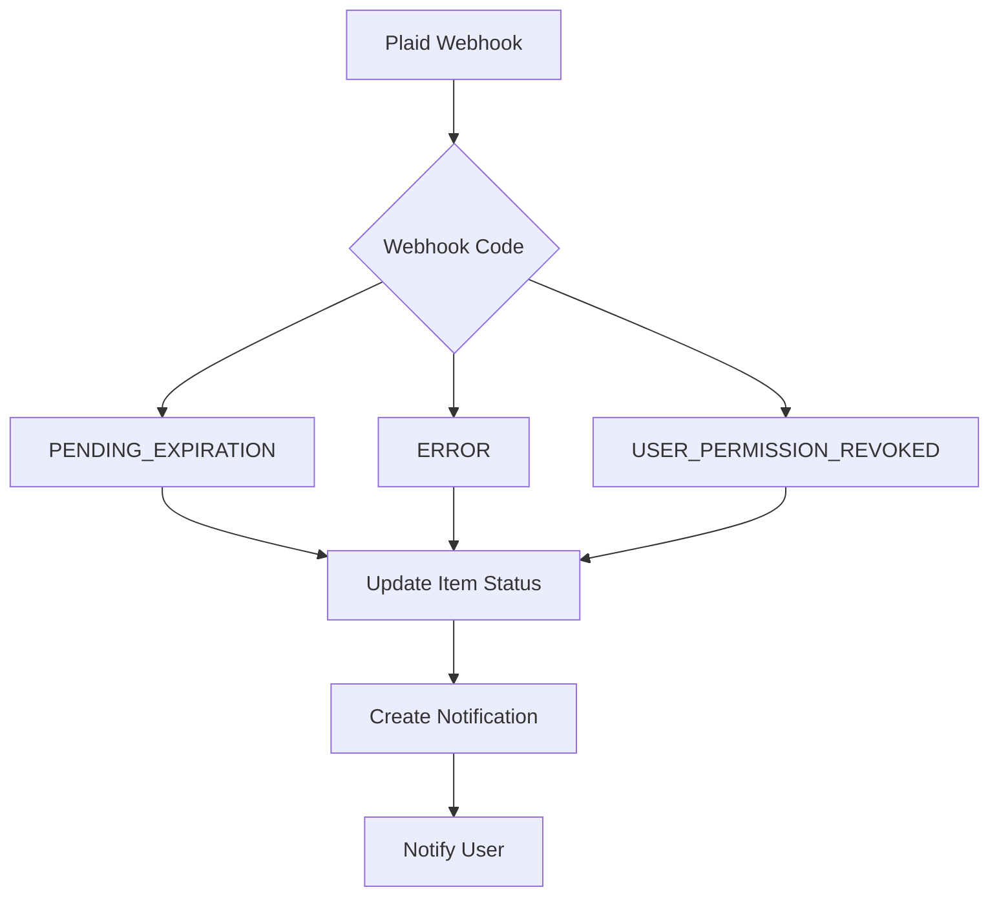
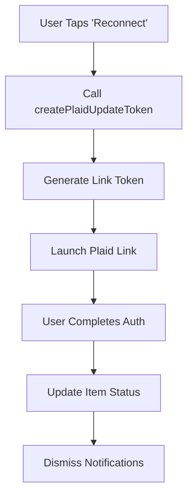

# Plaid Update Mode & Bank Connection Management

## 🎯 Overview

This implementation provides a comprehensive system for managing Plaid bank connections with **Update Mode** support, allowing users to seamlessly reconnect their bank accounts when authentication issues occur.

## 🔧 What's Been Implemented

### ✅ **PlaidConnectionService**
- **Real-time connection monitoring** with Firestore subscriptions
- **Connection health assessment** (healthy/warning/critical)
- **Notification management** for connection issues
- **Item status tracking** with automatic updates

### ✅ **Firebase Functions Integration**
- **Enhanced webhook handlers** for all Plaid item events
- **Automatic notification creation** based on webhook codes
- **Update Mode link token generation** via `createPlaidUpdateToken` function
- **Self-healing detection** with `LOGIN_REPAIRED` handling

### ✅ **User Interface Components**
- **ConnectionManagementScreen** - Full connection management dashboard
- **ConnectionStatusBanner** - App-wide notification banner
- **Real-time status updates** with connection health indicators

### ✅ **Update Mode Flow**
- **Automatic Update Mode detection** for connection issues
- **Seamless Link token generation** for reauthorization
- **Guided reconnection process** with clear error handling

## 📋 Plaid Webhook Events Handled

| Webhook Code | Status | Notification Type | Action Required |
|-------------|---------|------------------|----------------|
| `PENDING_EXPIRATION` | `pending_expiration` | ⚠️ Connection expiring in 7 days | ✅ Yes - Reconnect |
| `PENDING_DISCONNECT` | `pending_disconnect` | ⚠️ Connection will disconnect | ✅ Yes - Reconnect |
| `USER_PERMISSION_REVOKED` | `permission_revoked` | 🔴 Permissions revoked | ✅ Yes - Reconnect |
| `ERROR` | `error` | 🔴 Connection error | ✅ Yes - Reconnect |
| `NEW_ACCOUNTS_AVAILABLE` | `connected` | 🟡 New accounts detected | ⭕ Optional |
| `LOGIN_REPAIRED` | `connected` | 🟢 Auto-restored | ❌ No action |

## 🚀 Integration Steps

### 1. **Add to Navigation**

Add the connection management screen to your navigation:

```typescript
// In your navigation stack
<Stack.Screen 
  name="ConnectionManagement" 
  component={ConnectionManagementScreen}
  options={{ title: 'Bank Connections' }}
/>
```

### 2. **Add Connection Status Banner**

Add the banner to your main screens (HomeScreen, etc.):

```typescript
import ConnectionStatusBanner from '../components/ConnectionStatusBanner';

// In your screen component
<View>
  <ConnectionStatusBanner 
    onPress={(notification) => {
      // Navigate to connection management or handle reconnection
      navigation.navigate('ConnectionManagement');
    }}
  />
  {/* Rest of your screen content */}
</View>
```

### 3. **Update Firestore Security Rules**

Add these rules to allow connection data access:

```javascript
// In firestore.rules
match /plaid_items/{itemId} {
  allow read, write: if request.auth != null && 
    request.auth.uid == resource.data.userId;
}

match /connection_notifications/{notificationId} {
  allow read, write: if request.auth != null && 
    request.auth.uid == resource.data.userId;
}
```

### 4. **Update Package Dependencies**

Ensure you have the required packages:

```bash
npm install react-native-plaid-link-sdk
# or
yarn add react-native-plaid-link-sdk
```

## 📊 Database Schema

### **plaid_items** Collection
```typescript
{
  id: string;                    // Firestore document ID
  userId: string;                // User who owns this item
  itemId: string;                // Plaid item ID
  institutionId: string;         // Bank institution ID
  institutionName: string;       // Display name (e.g., "Chase Bank")
  accessToken: string;           // Plaid access token
  status: 'connected' | 'error' | 'pending_expiration' | 'pending_disconnect' | 'permission_revoked';
  lastWebhookCode?: string;      // Last received webhook code
  needsReauth: boolean;          // True if requires user action
  active: boolean;               // False if disconnected
  accounts: PlaidAccount[];      // Connected accounts array
  error?: PlaidError;            // Error details if applicable
  consentExpirationTime?: Date;  // When consent expires
  createdAt: Date;
  updatedAt: Date;
  lastSyncAt?: Date;            // Last successful data sync
}
```

### **connection_notifications** Collection
```typescript
{
  id: string;                    // Firestore document ID
  userId: string;                // User who receives notification
  itemId: string;                // Related Plaid item ID
  institutionName: string;       // Bank name for display
  type: 'reauth_required' | 'pending_expiration' | 'permission_revoked' | 'login_repaired' | 'new_accounts_available';
  title: string;                 // Notification title
  message: string;               // Detailed message
  actionRequired: boolean;       // True if user must take action
  dismissed: boolean;            // True if user dismissed
  priority: 'high' | 'medium' | 'low';
  createdAt: Date;
  expiresAt?: Date;             // Auto-dismiss time (for login_repaired)
}
```

## 🔄 Update Mode Flow

### 1. **Detection Phase**


### 2. **Reconnection Phase**


## 🛠 Customization Options

### **Notification Priorities**
- **High**: `reauth_required`, `permission_revoked` (Red banner)
- **Medium**: `pending_expiration`, `new_accounts_available` (Orange banner)  
- **Low**: `login_repaired` (Blue banner, auto-dismiss)

### **Connection Health Status**
- **Healthy**: All connections active and working
- **Warning**: Some connections need attention
- **Critical**: Critical errors requiring immediate action

### **Banner Display Logic**
- Shows highest priority notification requiring action
- Auto-dismisses after successful reconnection
- Persists until user takes action or dismisses

## 🔍 Monitoring & Analytics

### **Connection Health Metrics**
```typescript
const health = connectionService.getConnectionHealth(items);
// Returns: { total, connected, needsAttention, critical, status }
```

### **Real-time Subscriptions**
```typescript
// Monitor items
const unsubscribe = connectionService.subscribeToItemUpdates(userId, (items) => {
  // Handle item updates
});

// Monitor notifications  
const unsubscribe2 = connectionService.subscribeToNotifications(userId, (notifications) => {
  // Handle notification updates
});
```

## 🚨 Error Handling

### **Common Scenarios**
1. **Network Issues**: Graceful degradation with retry logic
2. **Token Expiration**: Automatic update mode triggering
3. **Permission Revocation**: Clear messaging with reconnection flow
4. **Institution Downtime**: Status updates with retry suggestions

### **User Communication**
- **Clear error messages** with suggested actions
- **Progress indicators** during reconnection
- **Success confirmations** after resolution
- **Help links** for complex issues

## 🔒 Security Considerations

- **Access tokens** stored securely in Firestore with user-based rules
- **Webhook verification** ensures authentic Plaid communications  
- **User authentication** required for all connection operations
- **Automatic cleanup** of expired notifications and tokens

## 📱 Mobile App Integration

The system works seamlessly with React Native Plaid Link SDK:

```typescript
// Example usage in your app
import { PlaidLink } from 'react-native-plaid-link-sdk';

// For update mode
PlaidLink.open({
  tokenConfig: {
    token: updateLinkToken, // From createPlaidUpdateToken
  },
  onSuccess: (success) => {
    // Handle successful reconnection
    console.log('Update success:', success);
  },
  onExit: (exit) => {
    // Handle exit/error scenarios  
    if (exit.error) {
      console.error('Update failed:', exit.error);
    }
  },
});
```

## 🎉 Benefits

### **For Users**
- **Proactive notifications** before connections break
- **One-tap reconnection** with clear guidance
- **Real-time status** visibility across the app
- **Automatic recovery** detection and dismissal

### **For Developers**  
- **Comprehensive webhook handling** for all scenarios
- **Real-time data synchronization** with Firestore
- **Modular components** for easy integration
- **Production-ready** error handling and logging

This system ensures your users never lose access to automatic receipt tracking due to expired bank connections, providing a seamless experience with proactive issue resolution.