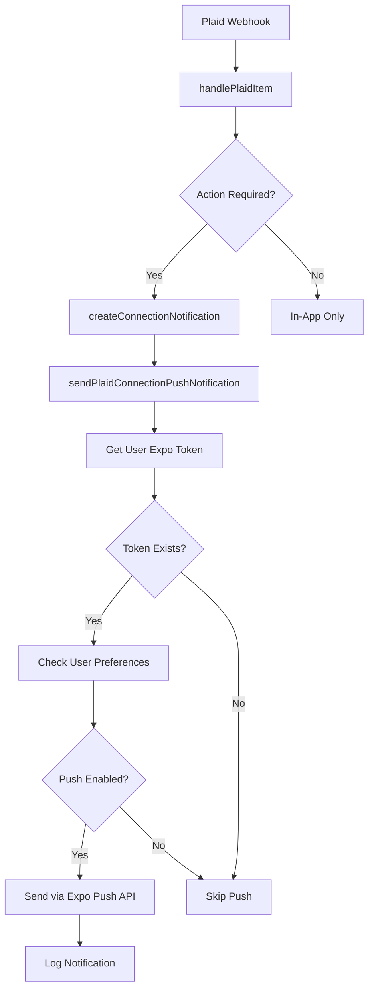

# Push Notifications for Plaid Bank Connection Issues

## 🎯 Overview

Users now receive **immediate push notifications** when their bank connections need attention, even when the app is closed. This ensures they never miss critical connection issues that could interrupt their receipt tracking.

## 📱 What's Been Implemented

### ✅ **Firebase Functions Integration**
- **Automatic push notifications** sent via Expo Push API when Plaid webhooks trigger
- **Smart notification logic** - only sends push for actionable issues
- **User preference checking** - respects notification settings
- **Comprehensive logging** for notification delivery tracking

### ✅ **Enhanced Notification Service**
- **Firestore token management** - saves/removes Expo push tokens
- **Deep link handling** - taps navigate to connection management  
- **Bank connection specific actions** - direct navigation to reconnection flow

### ✅ **Notification Types Covered**

| Issue Type | Push Notification | Action Required |
|------------|------------------|----------------|
| `PENDING_EXPIRATION` | ⚠️ Connection expires in 7 days | ✅ Reconnect now |
| `ERROR` / `ITEM_LOGIN_REQUIRED` | 🔴 Connection stopped working | ✅ Reconnect immediately |
| `USER_PERMISSION_REVOKED` | 🚫 Bank permissions revoked | ✅ Reconnect immediately |
| `LOGIN_REPAIRED` | ✅ Connection auto-restored | ❌ Informational only |
| `NEW_ACCOUNTS_AVAILABLE` | 🆕 New accounts found | ⭕ Optional connection |

## 🔧 Integration Steps

### 1. **Initialize Notification Service in AuthContext**

Add this to your login/authentication flow:

```typescript
// In AuthContext or wherever user signs in
import { NotificationService } from '../services/ExpoNotificationService';

const notificationService = NotificationService.getInstance();

// After successful login
useEffect(() => {
  if (user) {
    // Initialize notifications and save token
    notificationService.initialize();
    notificationService.saveTokenToFirestore(user.uid);
  }
}, [user]);

// On logout
const handleLogout = async () => {
  if (user) {
    await notificationService.removeTokenFromFirestore(user.uid);
    await notificationService.clearToken();
  }
  // ... rest of logout logic
};
```

### 2. **Setup Navigation for Push Notifications**

The `NavigationService` and `useNavigationIntent` hook have been created for you. Integrate them in your main App component:

```typescript
// In your main App.tsx or App.js
import React from 'react';
import { NavigationContainer } from '@react-navigation/native';
import NavigationService from './src/context/NavigationService';
import useNavigationIntent from './src/hooks/useNavigationIntent';

function App() {
  // Handle navigation intents from push notifications
  useNavigationIntent();

  return (
    <NavigationContainer
      ref={(ref) => {
        NavigationService.setNavigationRef(ref);
      }}
    >
      {/* Your app navigator */}
    </NavigationContainer>
  );
}

export default App;
```

### 3. **Update Firestore Security Rules**

Add these rules to allow push token storage:

```javascript
// In firestore.rules
match /users/{userId} {
  allow read, write: if request.auth != null && 
    request.auth.uid == userId;
  
  // Allow updating push tokens
  allow update: if request.auth != null && 
    request.auth.uid == userId &&
    request.writeFields.hasOnly(['expoPushToken', 'pushTokenUpdatedAt', 'notificationSettings']);
}

match /notification_logs/{logId} {
  allow create: if request.auth != null;
  allow read: if request.auth != null && 
    request.auth.uid == resource.data.userId;
}
```

### 4. **Test Push Notifications**

Use the Firebase Functions Emulator to test:

```bash
# Start emulator
firebase emulators:start --only functions,firestore

# Send test Plaid webhook
curl -X POST http://localhost:5001/receiptgold/us-central1/plaidWebhook \
  -H "Content-Type: application/json" \
  -d '{
    "webhook_type": "ITEM",
    "webhook_code": "PENDING_EXPIRATION",
    "item_id": "test_item_id"
  }'
```

## 📊 Push Notification Flow



## 🔔 Notification Examples

### **High Priority (Red)**
```
🔴 Bank Connection Issue
Chase connection stopped working. Tap to reconnect and restore receipt tracking.
```

### **Medium Priority (Orange)**
```
⚠️ Connection Expiring Soon  
Wells Fargo connection expires in 7 days. Reconnect now to avoid interruption.
```

### **Success (Green)**
```
✅ Connection Restored
Great news! Your Bank of America connection is working again. No action needed.
```

## 🛡️ Privacy & Security

### **Token Handling**
- **Partial logging**: Only first 20 characters logged for debugging
- **Secure storage**: Tokens stored in Firestore with user-based security rules
- **Auto cleanup**: Tokens removed on logout

### **User Control**
- **Granular settings**: Users can disable bank connection notifications
- **Quiet hours**: Respects user's quiet time preferences  
- **Frequency control**: Follows user's notification frequency settings

### **Error Handling**
- **Graceful fallbacks**: Failed push notifications don't break the webhook flow
- **Comprehensive logging**: All notification attempts logged for debugging
- **Retry logic**: Built-in error handling for Expo Push API failures

## 🚀 Benefits

### **For Users**
- **Never miss critical issues** - Push notifications work even when app is closed
- **Immediate action** - Tap notification to go directly to reconnection flow
- **Peace of mind** - Know instantly when receipt tracking might be interrupted
- **Smart notifications** - Only get pushed for issues requiring action

### **For Your Business**
- **Higher retention** - Users fix connection issues faster
- **Better UX** - Proactive problem resolution vs reactive discovery
- **Reduced support** - Users self-serve connection problems
- **Data continuity** - Less gaps in receipt tracking data

## 🔍 Monitoring & Analytics

### **Notification Logs**
All push notifications are logged in the `notification_logs` collection:

```typescript
{
  userId: string;
  type: 'push_notification';
  notificationType: 'plaid_connection_issue';
  title: string;
  institutionName: string;  
  itemId: string;
  status: 'sent' | 'failed';
  response?: any; // Expo API response
  error?: string; // If failed
  createdAt: Timestamp;
}
```

### **Success Metrics to Track**
- **Push delivery rate**: % of notifications successfully sent
- **User engagement**: % of users who tap notifications  
- **Issue resolution**: Time from notification to reconnection
- **Connection health**: Overall improvement in connection stability

The push notification system ensures users stay connected to their banks and never lose receipt tracking due to expired connections! 🎉