# 🧪 Plaid Webhook Testing Guide

## Quick Start

### 1. **Run the Test Script**

```bash
# Make the script executable
chmod +x test-plaid-webhooks.js

# Run all webhook tests
node test-plaid-webhooks.js

# Test specific webhook
node test-plaid-webhooks.js ITEM PENDING_EXPIRATION
node test-plaid-webhooks.js ITEM ERROR
```

### 2. **What Each Test Does**

| Test | Webhook Code | Expected Result |
|------|--------------|----------------|
| Connection Expiring | `PENDING_EXPIRATION` | 📱 Medium priority push: "⚠️ Connection expires in 7 days" |
| Connection Error | `ERROR` | 📱 High priority push: "🔴 Bank connection stopped working" |
| Permissions Revoked | `USER_PERMISSION_REVOKED` | 📱 High priority push: "🚫 Bank permissions revoked" |
| New Accounts | `NEW_ACCOUNTS_AVAILABLE` | 📱 Medium priority push: "🆕 New accounts found" |
| Auto-Repaired | `LOGIN_REPAIRED` | 📱 Low priority push: "✅ Connection restored" |
| New Transactions | `TRANSACTIONS` | 🗄️ Creates transaction_updates record (no push) |

### 3. **Prerequisites**

Before running tests, make sure you have:

1. **Firebase Functions deployed** with the webhook handlers
2. **A test user** in Firestore with an `expoPushToken`
3. **A test Plaid item** in your `plaid_items` collection

## 🔧 Test Data Setup

### Create Test User in Firestore

Add this document to `users/{userId}`:

```json
{
  "email": "test@receiptgold.com",
  "expoPushToken": "ExpoToken[your-test-token]",
  "notificationSettings": {
    "push": true,
    "bankConnections": true,
    "receipts": true,
    "security": true
  },
  "createdAt": "2024-01-01T00:00:00Z"
}
```

### Create Test Plaid Item in Firestore

Add this document to `plaid_items/{itemId}`:

```json
{
  "userId": "your-test-user-id",
  "itemId": "test_item_12345",
  "institutionId": "ins_109508",
  "institutionName": "Chase Bank",
  "accessToken": "access-sandbox-test-token",
  "status": "connected",
  "active": true,
  "needsReauth": false,
  "accounts": [
    {
      "accountId": "test_account_1",
      "name": "Chase Checking",
      "type": "depository",
      "subtype": "checking",
      "mask": "1234",
      "currency": "USD",
      "selected": true
    }
  ],
  "createdAt": "2024-01-01T00:00:00Z",
  "updatedAt": "2024-01-01T00:00:00Z"
}
```

## 📱 Testing Push Notifications

### Option 1: Use Your Device
1. **Install Expo Go** on your phone
2. **Run your app** and sign in as the test user
3. **Get your real Expo token** and update the test user document
4. **Run the webhook tests**
5. **Check your phone** for push notifications

### Option 2: Use Expo Push Tool
1. Go to https://expo.dev/notifications
2. Enter your Expo push token
3. Send a test notification to verify the token works
4. Run the webhook tests

## 🔍 Debugging

### Check Firebase Functions Logs
```bash
# View recent logs
firebase functions:log

# Follow logs in real-time
firebase functions:log --only plaidWebhook
```

### Check Firestore Collections
1. **connection_notifications** - Should have new notification documents
2. **notification_logs** - Should have push notification delivery logs
3. **plaid_items** - Should show updated status and lastWebhookCode

### Common Issues

| Issue | Solution |
|-------|----------|
| No push notification | Check user's expoPushToken in Firestore |
| Webhook fails | Verify Firebase Functions are deployed |
| Invalid item ID | Update TEST_ITEM_ID in script to match your test data |
| Token expired | Generate new Expo push token |

## 🚀 Production Testing

### Using Real Plaid Sandbox Webhooks

If you have a real Plaid sandbox item, you can use the actual webhook firing API:

```bash
# Edit test-plaid-webhooks.js and update:
const TEST_ACCESS_TOKEN = 'access-sandbox-your-real-token';

# Then run:
node test-plaid-webhooks.js
```

### Webhook.site Testing

1. Go to https://webhook.site
2. Copy your unique URL
3. Update WEBHOOK_URL in the test script
4. Run tests and see the raw webhook payloads

## 📊 Expected Flow

```mermaid
graph TD
    A[Run Test Script] --> B[Send Webhook to Firebase Function]
    B --> C[handlePlaidItem Function]
    C --> D[Update Firestore plaid_items]
    D --> E[createConnectionNotification]
    E --> F[Save to connection_notifications]
    F --> G[sendPlaidConnectionPushNotification]
    G --> H[Send to Expo Push API]
    H --> I[📱 User Gets Notification]
    I --> J[User Taps Notification]
    J --> K[App Opens to ConnectionManagement]
```



## 🎯 Success Criteria

✅ **Webhook Processed**: Firebase Functions logs show successful webhook handling  
✅ **Notification Created**: New document in connection_notifications collection  
✅ **Push Sent**: Entry in notification_logs with status: "sent"  
✅ **Mobile Alert**: Push notification appears on device  
✅ **Navigation**: Tapping notification opens app to correct screen

Run the tests and let the notifications flow! 🎉